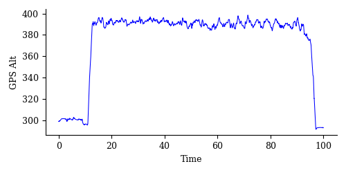
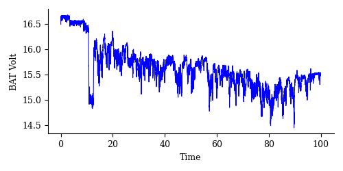

# Analysis-of-Mission-Planner-log-files
Python code to read, analyze and visualize *.log files containing flight data recorded by a Pixhawk autopilot

## Usage
```python
From FileProcessing import LogFileProcessing

# Create a new instance for the LogFileProcessing class
analysis = LogFileProcessing('00000039.log')

# Enjoy, you can plot any Parameter and Subparameter VS Time
analysis.Plot('GPS', 'Alt')
analysis.Plot('GPS', 'Spd')
analysis.Plot('BARO', 'Alt')
analysis.Plot('BAT', 'Volt')
analysis.Plot('POWR', 'VServo')

# Get data for further analysis
y = analysis.Data['GPS']['Alt'][1:]     # This is the variable of interest
x = np.linspace(0, 100, len(y))         # This is the variable Time
```

## Sample plots
* Plot 1: Absolute flight altitude during the flight missionm, recorded by GPS


* Plot 2: Oscillation of battery voltage during the flight mission


## Language
Python 3
## Requirements
* Numpy
* Matplotlib

## Example of log file
An example of a log file is provided as a compressed file. Uncompress the **00000039.7z** file.
